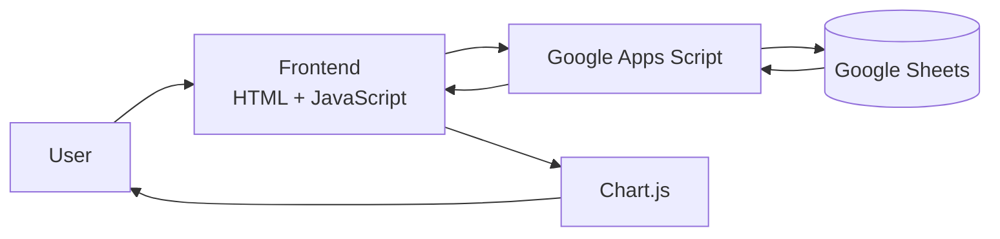

# 💰 BudgetIn
### Modern Personal Finance Dashboard powered by Google Sheets

[](https://developers.google.com/apps-script)
[](https://www.google.com/sheets/about/)
[](https://developer.mozilla.org/en-US/docs/Web/JavaScript)
[](https://tailwindcss.com/)
[](https://www.chartjs.org/)
[](LICENSE)

> **BudgetIn** is a modern personal finance dashboard that transforms Google Sheets into an interactive budgeting application without requiring a separate database or paid backend infrastructure.

BudgetIn memungkinkan pengguna mengelola anggaran, mencatat pengeluaran, memantau pembayaran, serta memvisualisasikan kondisi keuangan melalui dashboard yang responsif.

Arsitektur aplikasi memanfaatkan **Google Sheets sebagai data store** dan **Google Apps Script sebagai backend**, sehingga pengguna dapat mempertahankan data di dalam ekosistem Google miliknya sendiri.

---

## ✨ Why BudgetIn?

Mengelola keuangan pribadi menggunakan spreadsheet memang fleksibel, tetapi pengalaman pengguna masih sangat bergantung pada struktur tabel dan formula manual.

BudgetIn mencoba menyelesaikan masalah tersebut dengan memberikan lapisan antarmuka modern di atas Google Sheets.

### Masalah

* Spreadsheet membutuhkan interaksi manual yang cukup banyak.
* Visualisasi data sering kali terpisah dari data transaksi.
* Penggunaan pada perangkat mobile kurang nyaman.
* Perubahan struktur wallet atau kategori sering membutuhkan editing spreadsheet secara langsung.
* Pengguna membutuhkan dashboard yang lebih mudah dipahami daripada tabel mentah.

### Solusi

BudgetIn menyediakan:

* Dashboard finansial berbasis web.
* Sinkronisasi data dengan Google Sheets.
* Visualisasi anggaran dan pengeluaran.
* Responsive UI untuk desktop dan mobile.
* Pengelolaan wallet dan kategori langsung dari aplikasi.
* Filtering berdasarkan bulan dan tahun.
* Progress tracking untuk realisasi anggaran.

---

# 🚀 Key Features

## 🔄 Real-time Google Sheets Synchronization

Setiap perubahan dari web application dikirim kembali ke Google Sheets melalui Google Apps Script.

Contoh operasi:

* Menambahkan alokasi anggaran.
* Mengubah kategori.
* Menambahkan wallet.
* Menandai tagihan sebagai lunas.
* Memperbarui data pengeluaran.

Tidak diperlukan database eksternal untuk menyimpan data utama aplikasi.

---

## 📊 Interactive Financial Dashboard

BudgetIn menyediakan visualisasi untuk membantu pengguna memahami kondisi keuangan secara cepat.

Komponen visualisasi menggunakan **Chart.js**, termasuk:

* Pill-style bar chart
* Doughnut chart
* Budget allocation
* Spending distribution
* Progress realisasi pengeluaran

---

## 📱 Responsive Design

Dashboard dirancang untuk digunakan pada berbagai ukuran layar.

### Desktop

Data ditampilkan dalam bentuk tabel dan dashboard dengan informasi yang lebih lengkap.

### Mobile

Tampilan tabel beradaptasi menjadi **card-based layout** agar lebih mudah digunakan pada layar kecil.

BudgetIn juga dapat ditambahkan ke Home Screen pada perangkat mobile sehingga memberikan pengalaman yang menyerupai aplikasi standalone.

---

## 🏷️ Dynamic Wallet & Category Management

Pengguna tidak perlu membuka spreadsheet hanya untuk menambahkan konfigurasi baru.

Melalui interface aplikasi, pengguna dapat menambahkan:

* Wallet / Account
* Expense Category

Proses dilakukan melalui modal atau pop-up interface.

---

## 💸 Payment Tracking

BudgetIn menyediakan mekanisme untuk menandai pembayaran sebagai selesai.

Saat item ditandai sebagai lunas:

* Status pembayaran diperbarui.
* Teks dapat ditampilkan dalam kondisi tercoret.
* Progress pengeluaran diperbarui.
* Data disinkronkan ke Google Sheets.

---

## 📅 Multi-Month Budget Tracking

Dashboard dapat melakukan filtering berdasarkan:

* Bulan
* Tahun
* Wallet
* Kategori

Dengan demikian, satu spreadsheet dapat digunakan untuk mengelola data keuangan dari beberapa periode.

---

## 👋 Personalized User Experience

Aplikasi dapat memberikan greeting berdasarkan akun Google yang sedang digunakan.

Contoh:

```text
Good Morning, Ade 👋

Here's your financial overview for September 2026.
```

---

# 🏗️ System Architecture

BudgetIn menggunakan arsitektur sederhana yang memanfaatkan ekosistem Google.



### Data Flow

```text
User
  │
  ▼
BudgetIn Web Interface
  │
  ▼
Google Apps Script
  │
  ▼
Google Sheets
  │
  ▼
Google Apps Script
  │
  ▼
Dashboard Update
```

Pendekatan ini menghilangkan kebutuhan terhadap:

* Dedicated server
* External SQL database
* Authentication server
* Paid backend infrastructure

Namun, akses data tetap mengikuti permission dan konfigurasi deployment Google Apps Script yang digunakan.

---

# 🛠️ Technology Stack

| Layer          | Technology           | Purpose                 |
| -------------- | -------------------- | ----------------------- |
| Frontend       | HTML5                | Application structure   |
| Frontend Logic | Vanilla JavaScript   | Client-side interaction |
| Styling        | Tailwind CSS         | Responsive UI           |
| Visualization  | Chart.js             | Financial charts        |
| Icons          | Font Awesome 6       | UI icons                |
| Typography     | Google Fonts / Inter | Interface typography    |
| Backend        | Google Apps Script   | API & business logic    |
| Data Store     | Google Sheets        | Financial data storage  |

---

# 📂 Project Structure

Struktur repository dibuat sederhana agar mudah dipahami dan dikembangkan.

```text
budgetin/
│
├── Code.gs
│   └── Google Apps Script backend
│
├── Index.html
│   └── Frontend application
│
├── LICENSE
│   └── MIT License
│
└── README.md
    └── Project documentation
```

---

# 🖥️ Interface Preview

## Dashboard

> Tambahkan screenshot dashboard utama repository pada bagian ini.

```text
📸 screenshots/dashboard.png
```


---

## Wallet & Category Management

> Tambahkan screenshot modal pengelolaan wallet dan kategori.

```text
📸 screenshots/wallet-category.png
```


---

# 🚀 Getting Started

## Prerequisites

Sebelum melakukan deployment, pastikan Anda memiliki:

* Google Account
* Akses ke Google Sheets
* Akses ke Google Apps Script
* Browser modern seperti Chrome, Edge, Firefox, atau Safari

---

# 1. Copy the Database Template

Gunakan template Google Sheets berikut:

👉 [**Copy BudgetIn Template**](https://docs.google.com/spreadsheets/d/1r-MKKP6zqpHTkXCj88lIRkRn-FUsZ1F8_1NMbj-D5zQ/copy)

Kemudian klik:

```text
Make a copy
```

Spreadsheet hasil salinan akan menjadi data store untuk instance BudgetIn Anda.

---

# 2. Open Apps Script

Pada Google Sheets:

```text
Extensions
    ↓
Apps Script
```

Buka file:

```text
Code.gs
```

Hapus kode bawaan dan masukkan seluruh isi `Code.gs` dari repository.

---

# 3. Add Frontend

Pada Apps Script Editor:

```text
+
    ↓
HTML
```

Berikan nama:

```text
Index
```

Kemudian masukkan seluruh isi dari:

```text
Index.html
```

Simpan project.

---

# 4. Deploy Web App

Pada Apps Script Editor:

```text
Deploy
    ↓
New deployment
```

Pilih:

```text
Select type
    ↓
Web app
```

Gunakan konfigurasi sesuai kebutuhan deployment Anda.

Contoh konfigurasi:

| Setting        | Value         |
| -------------- | ------------- |
| Description    | `BudgetIn v1` |
| Execute as     | `Me`          |
| Who has access | `Anyone`      |

Klik:

```text
Deploy
```

Google kemudian akan meminta authorization berdasarkan permission yang dibutuhkan aplikasi.

Setelah deployment selesai, salin:

```text
Web app URL
```

URL tersebut digunakan untuk mengakses BudgetIn.

> **Security note:** Konfigurasi `Who has access: Anyone` membuat URL web app dapat diakses sesuai mekanisme permission yang ditetapkan pada deployment. Jangan menggunakan konfigurasi publik untuk data yang tidak seharusnya dapat diakses oleh pihak lain.

---

# 📱 Mobile Installation

BudgetIn dapat digunakan dari browser mobile.

Pada perangkat mobile:

```text
Open Web App
    ↓
Browser Menu
    ↓
Add to Home Screen
```

Setelah ditambahkan, BudgetIn dapat dibuka seperti aplikasi web pada Home Screen.

---

# 🔧 Configuration

Pada deployment sendiri, pastikan struktur Google Sheets sesuai dengan struktur yang diharapkan oleh `Code.gs`.

Secara konsep:

```text
Google Sheets
│
├── Budget / Allocation
├── Transactions
├── Wallet
├── Categories
└── Monthly Data
```

> Struktur sheet yang sebenarnya harus mengikuti implementasi pada `Code.gs`. Jangan menambahkan atau mengganti nama sheet secara sembarangan apabila backend masih mengandalkan nama tersebut.

---

# 🔄 Application Workflow

Contoh alur ketika pengguna menandai pembayaran sebagai lunas:

```text
User clicks "Paid"
        │
        ▼
Frontend updates UI
        │
        ▼
JavaScript sends request
        │
        ▼
Google Apps Script
        │
        ▼
Validate request
        │
        ▼
Update Google Sheets
        │
        ▼
Return updated data
        │
        ▼
Dashboard refreshes state
```

Pendekatan tersebut membuat interface dapat memperbarui state tanpa mengharuskan pengguna melakukan reload halaman secara manual.

---

# 🧩 Design Principles

BudgetIn dikembangkan dengan beberapa prinsip:

### Simplicity

Tidak menggunakan infrastruktur backend yang kompleks untuk kebutuhan budgeting pribadi.

### Accessibility

Interface dirancang agar tetap nyaman digunakan dari desktop maupun mobile.

### Data Ownership

Data utama berada pada Google Sheets milik pengguna, bukan pada database SaaS eksternal.

### Low Infrastructure Cost

Tidak membutuhkan server database atau backend berbayar terpisah.

### User-Friendly Interaction

Operasi umum seperti pembayaran, wallet, dan kategori dilakukan dari UI aplikasi.

---

# 🔐 Security & Privacy Considerations

BudgetIn menggunakan Google Sheets sebagai data store dan Google Apps Script sebagai backend.

Artinya, kontrol terhadap data sangat bergantung pada:

* Google Account yang digunakan.
* Permission spreadsheet.
* Permission Apps Script.
* Konfigurasi deployment Web App.
* Siapa saja yang diberikan akses ke URL aplikasi.

Untuk penggunaan dengan data sensitif, hindari konfigurasi akses publik tanpa memahami konsekuensinya.

**BudgetIn tidak menggunakan klaim "fully secure" hanya karena tidak mempunyai external database.** Tidak adanya server eksternal bukan berarti seluruh aplikasi otomatis aman.

---

# 📌 Project Highlights

BudgetIn merupakan contoh implementasi aplikasi full-stack ringan yang menggabungkan:

```text
Modern Web UI
       +
Client-side JavaScript
       +
Google Apps Script
       +
Google Sheets
       +
Data Visualization
```

Proyek ini menunjukkan bagaimana Google Workspace dapat digunakan sebagai application platform untuk aplikasi finansial personal dengan kebutuhan infrastruktur yang relatif rendah.

---

# 🤝 Contributing

Contributions, bug fixes, documentation improvements, and feature ideas are welcome.

### 1. Fork Repository

```bash
git fork <repository-url>
```

### 2. Create Feature Branch

```bash
git checkout -b feature/nama-fitur
```

### 3. Commit Changes

```bash
git add .
git commit -m "feat: add new feature"
```

### 4. Push Branch

```bash
git push origin feature/nama-fitur
```

### 5. Open Pull Request

Buat Pull Request dan jelaskan:

* Masalah yang diselesaikan.
* Perubahan yang dibuat.
* Dampak terhadap fitur existing.
* Screenshot apabila terdapat perubahan UI.

---

# 📄 License

This project is licensed under the **MIT License**.

Lihat file [LICENSE](LICENSE) untuk informasi lengkap.

---

# 👨‍💻 Author

**BudgetIn**

Modern personal finance dashboard built with:

```text
Google Apps Script
+
Google Sheets
+
Vanilla JavaScript
+
Tailwind CSS
+
Chart.js
```

---

<p align="center">

</p>
